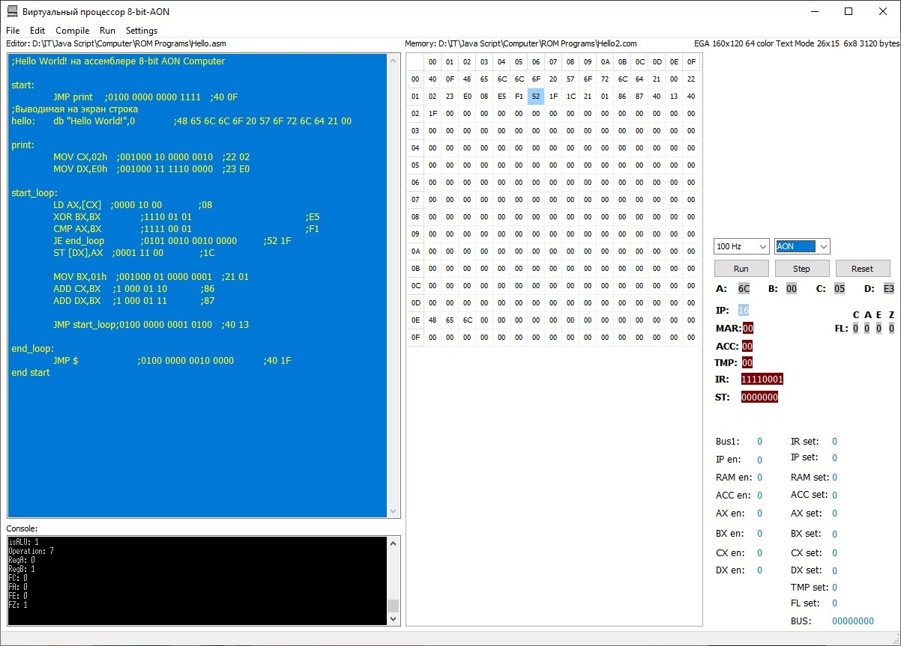

# Компилятор и виртуальный процессор 8-bit-AON 

Коллекция виртуальных машин и компиляторов в одном приложении.  

Содержит следующие виртуальные машины:  
- виртуальный 8-битный процессор 8-bit-AON
- стековая виртуальная машина OVM  

Компиляторы для них:
- ассемблер для OVM
- компилятор языка Oberon для OVM

Написан на Delphi.

Статус проекта: Разрабатывается.

Первая версия проекта была написана на Java Script для работы в браузере.  
Ее можно увидеть [по ссылке](https://gorcomcomputing.github.io/8-bit-AON-Computer/).   

## Характеристики виртуального процессора 8-bit-AON
AON в названии виртуального процессора означает, что процессор спроектирован из логических вентилей AND, OR, NOT в стиле языков описания аппаратуры HDL.
- CPU 8-bit DATA, 16-bit ADDRESS;
- 4 общих 8-битных регистра;
- RAM, ROM, VRAM 64KB;
- Graphics 64-color 160x120 px, 26x15 text;
- Keyboard.

Copyright (c) 2023 Evgeny Goryachev    
Gor.Com 

